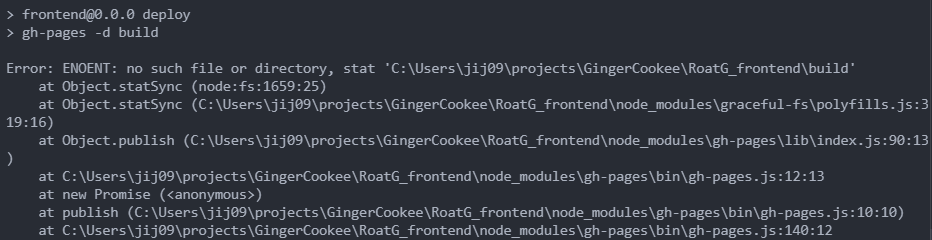

# Github Pages 배포

React로 개발한 RoatG 프로젝트를 Github Pages에 배포하려고 하니, 문제가 발생했다.

1. 명령어가 잘못됐나?

일단 gh-pages 배포를 위해 package.json에 배포 명령어를 설정했다.

```
"predeploy": "npm run build",
"deploy": "gh-pages -d build"
```


그런데 이런 오류가 뜬다. 이유를 찾기 위해 스크립트의 뜻부터 찾아봤다.

먼저 `npm run build` 명령어는 기존의 `build` 스크립트를 실행하게끔 한다.

```
"build": "tsc -b && vite build",
```

`tsc -b`는 타입스크립트 빌드 명령어이다. `tsc --build`(약식은 `tsc -b`)를 실행하면 다음 작업을 거쳐 Typescript 프로젝트를 빌드한다.

- tsconfig.json 파일을 참고한다.
- Typescript 코드를 Javascript로 컴파일한다.
- 필요한 타입 정의 파일을 생성한다.

`vite build`는 vite를 이용하여 프로젝트를 빌드하는 명령어이다.

- 환경변수 로드(.env 등)
- vite,config.ts 로드
- HTML, CSS, Javascript, 이미지 등 리소스 번들링 및 최적화

즉 predeploy 스크립트에 작성한 과정은 문제가 없다. 하지만 주목할 점은, vite는 CRA와 달리 프로젝트를 빌드할 경우 `build`폴더가 아닌 `dist`폴더를 생성한다는 것이다.

```
"deploy": "gh-pages -d build"
```

위 명령어는 build 디렉토리를 "homepage"에 적은 웹사이트 주소에 업로드하도록 만든다. 이 디렉토리 내용은 gh-pages 브랜치에 push된다.

하지만 우리는 dist폴더가 생성되었으므로, 스크립트를 다음과 같이 수정해야한다.

```
"deploy": "gh-pages -d dist"
```

이후 `npm run deploy`를 실행하면 node.js가 predeploy를 먼저 실행시키고, 이후 deploy가 실행된다.

2. 빈 화면이 로딩된다.

이렇게 잘 배포했는데, 화면에 아무것도 뜨지 않는다.

---

Reference
https://www.typescriptlang.org/ko/docs/handbook/project-references.html
